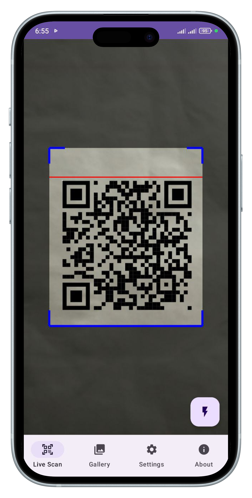
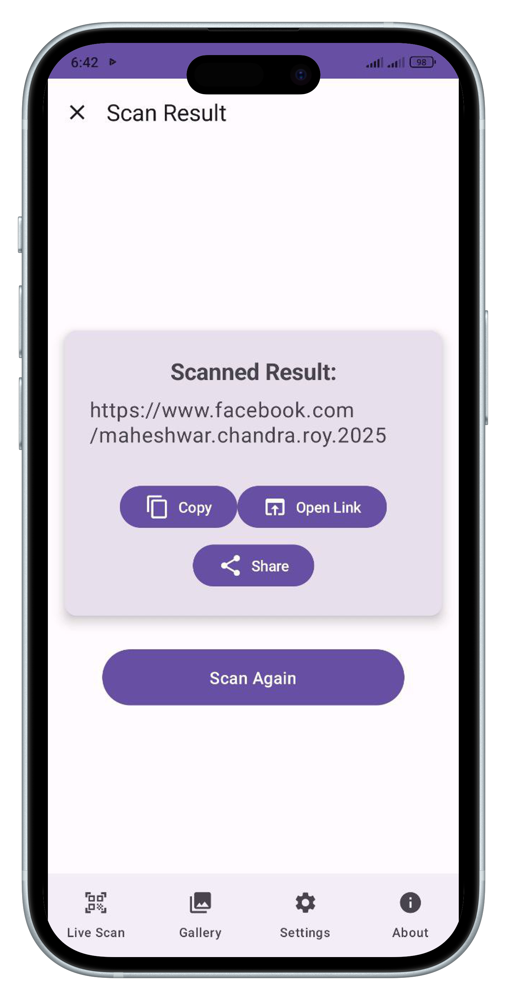
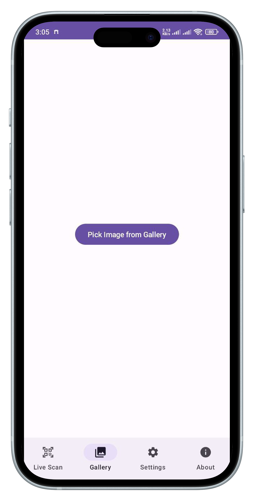

# QR Scanner Hub - Fast, Secure QR & Barcode Scanner (Official Landing Page)

Welcome to the official landing page of the QR Scanner Hub application! This is a fast, secure, and user-friendly QR code and barcode scanner designed to meet your daily scanning needs.

## ✨ Key Features

QR Scanner Hub brings you a state-of-the-art scanning experience:

* **⚡ Live Scanning:** Quickly and accurately scan any QR code and barcode in real-time.
* **🖼️ Gallery Scan:** Easily scan QR codes or barcodes from images saved in your device's gallery.
* **📶 Offline Mode:** Scan and decode without an internet connection – anytime, anywhere.
* **📋 Result Management:** Conveniently copy, share, or directly open links from scanned data.
* **🔒 Your Data is Secure:** We prioritize your privacy. The app does not collect, store, or transmit any personal data to our servers.
* **📳 Vibrate on Scan:** Option to enable/disable vibration upon successful scan for personalized feedback.

## 📸 Screenshots

See how the app looks and functions with these screenshots:

| Screenshot 1 | Screenshot 2 | Screenshot 3 | Screenshot 4 |
| :-------------: | :-------------: | :--------: | :-----------: |
|  |  |  |  |

## 🚀 How to Use

Installing and using QR Scanner Hub is very simple:

1.  **Download the APK:** Click the "Download APK" button above to get the latest version of the app.
2.  **Install (Allow 'Unknown Sources'):** Open the downloaded APK file. If your device doesn't allow app installations from 'Unknown Sources', enable it in your settings before starting the installation.
    *(Typically: Settings > Security > Unknown Sources or Settings > Apps & notifications > Special app access > Install unknown apps)*
3.  **Grant Necessary Permissions:** When you open the app for the first time, it may ask for necessary permissions like camera and gallery access. Please grant these permissions for full scanning functionality.
4.  **Start Scanning!** Now you can scan QR codes or barcodes using the live camera or by uploading images from your gallery.

## ⬇️ Download Now!

Transform your smartphone into a powerful scanning tool!

[**

**](https://github.com/bnbxeth/qr-scanner-hub-landing/releases/download/v1.1.1/app-release.apk)

## 🛡️ Privacy Policy

QR Scanner Hub highly values your privacy. Our app does not collect, store, or transmit any personal data or scanned information to our servers or any third parties. All scanning, decoding, and data processing (such as copying, opening links, or sharing results) happen entirely on your device. We are committed to maintaining the privacy and security of your information.

To view the full privacy policy, please visit: [QR Scanner Hub Privacy Policy](https://bnbxeth.github.io/qr-scanner-hub-policy/)

## 🧑‍💻 Developer

This app was developed by:

**Maheshwar Chandra Roy**

Feel free to contact us if you have any questions or need assistance:

📧 [maheshwarchandra.dev@gmail.com](mailto:maheshwarchandra.dev@gmail.com)

---

&copy; 2025 QR Scanner Hub. All rights reserved.
